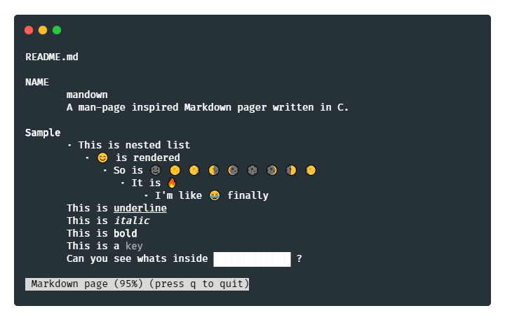

# mandown - mdn

A man-page inspired Markdown pager written in C.

**Name change:** executable's name changed to `mdn`

## What is it

Need to lookup things from README? Or from manual page? Or perhaps just want to install something cool...

## Update

- User Customization
  - Added control schemes: mdn, vim, less(default since mdn isn't complete)
  - Config file location: `~/.config/mdn/mdnrc`

## Sample



## Installation

Current version is still being developed for some HTML tags. However, it should work on most Markdown documents.

### Homebrew
```shell
$ brew install mandown
```

The installed binary `mdn` would be at `/usr/local/bin/`

```shell
$ git clone https://github.com/Titor8115/mandown.git
$ cd mandown
$ make install
```

To remove the binary, you can run the commands below, or remove manually.

```shell
$ cd mandown
$ make uninstall
```

If you just want to compile and test it.

```shell
$ cd mandown
$ make
```

Feel free to create an issue.

## Usage

Check out the new sample

```shell
$ mdn sample.md
```

Mouse wheel scrolling is supported! (if your terminal emulator allows)

Scroll Up: <kbd>↑</kbd>, <kbd>k</kbd>

Scroll Down: <kbd>↓</kbd>, <kbd>j</kbd>

Page Up: <kbd>space bar</kbd>,  <kbd>pg up</kbd>, <kbd>fn + ↑</kbd>a, <kbd>b</kbd>

Page Down:  <kbd>back space</kbd>,  <kbd>pg down</kbd>, <kbd>fn + ↓</kbd>, <kbd>f</kbd>

Select & Get href: <kbd>tab</kbd> or double click <kbd>mouse 1</kbd> & <kbd>enter</kbd>

Exit: <kbd>q</kbd>

To read detailed usage, run `mdn -h`

## libmandown

Mandown can also be embedded in your own applications. To render a Markdown document in a C string:

```c
#include "mandown.h"

char *str ="# Heading\n\nThis is some **BOLD** *italic* ***EMPHASIZED*** text.";
render_str(str, "md", "Test Title", NULL);
```

To render a Markdown document file:

```c
#include "mandown.h"

FILE *fp = fopen("README.md", "r");
render_file(fp, "md", "Test file", NULL);
```

Static and shared libraries are available. Make sure you have installed the dependencies listed in **Library dependency** below, then assuming you installed Mandown under `/usr/local`:

```shell
# static build
gcc -o myprog -I/usr/local/include myprog.c /usr/local/lib/mandown.a -lncurses -lxml2 -lconfig

# shared build
gcc -o myprog -I/usr/local/include myprog.c -L/usr/local/lib -lmandown -lncurses -lxm2 -lconfig
```

## Library dependency

Mandown requires `libncurses(w)`, `libxml2` and `libconfig` as compile-time dependencies.

Make sure you have them installed before compiling.

### Debian

```shell
$ apt-get install libncursesw5-dev
$ apt-get install libxml2-dev
$ apt-get install libconfig-dev
```

## Todo

- [x] Line fold/wrap on white space
- [x] Optimized resizing
- [ ] Table and contents rendering
- [x] Makefile makeover
